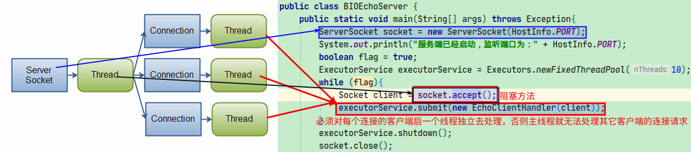
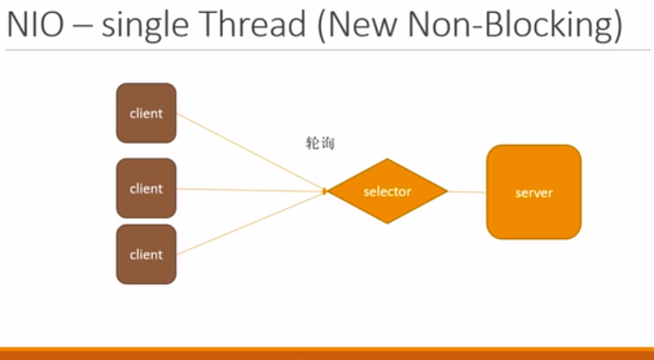
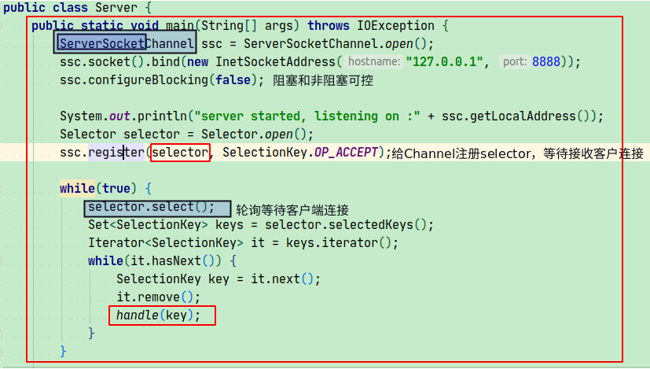
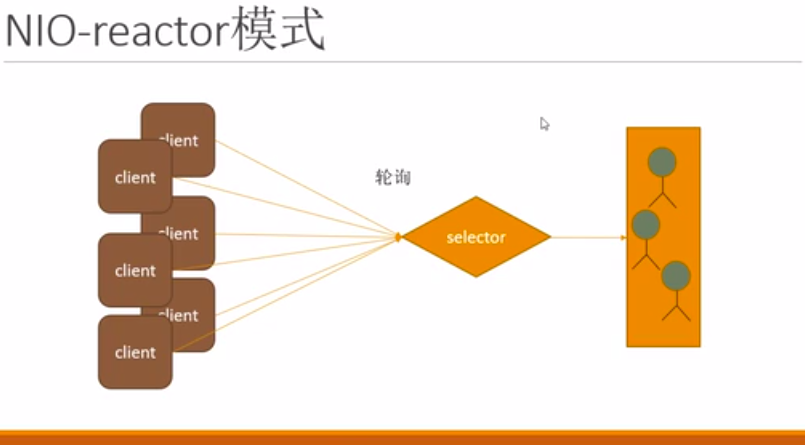
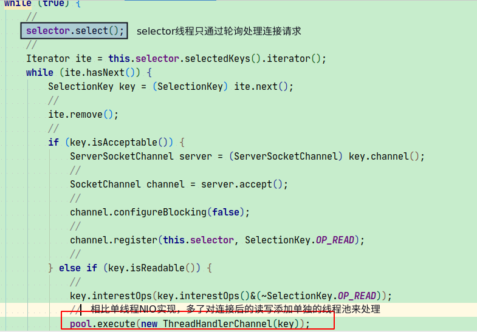
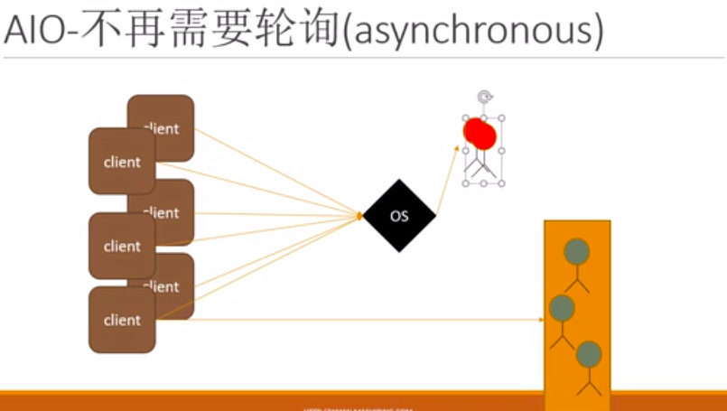
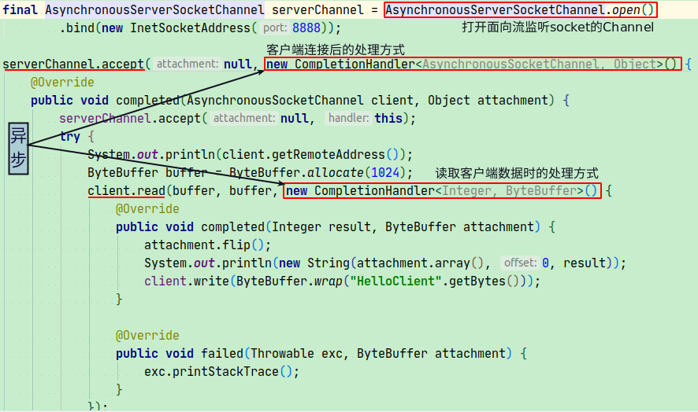
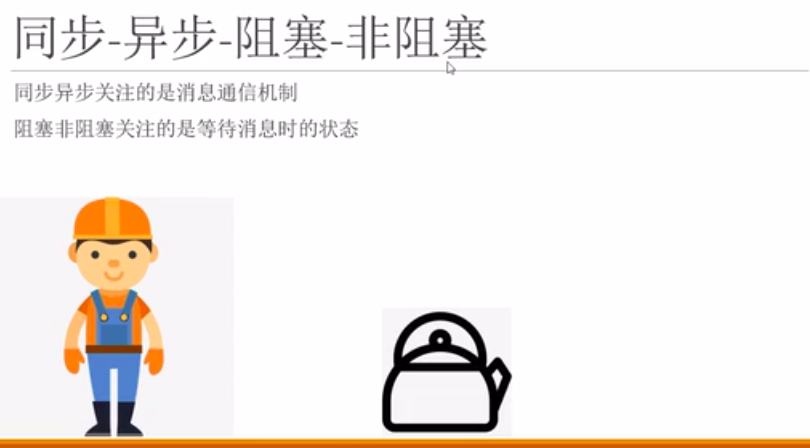

# IO 分析
## BIO（Blocking IO）
-   模型
    
    
## NIO(New Non-Blocking IO)
-   single-Thread Model
    
   -    代码实现
   
-    reactor Mode
      
   -    代码实现
     
   
-   三大核心组件
    -   Selector
    -   Channel   
    -   Buffer
    
-   参考地址：https://www.cnblogs.com/snailclimb/p/9086334.html   
   
## AIO(Asynchrous Non-Blocking IO)    
-   模型
      
-   代码实现
         
    
    
## 区分：同步/异步、阻塞/非阻塞
           
